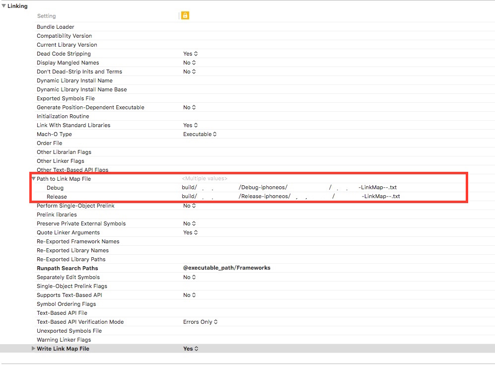

# LinkSize
LinkSize is a tool for calcute  size of static library or Framework link in App on Mac OSX.
LinkSize parse LinkMap file generated by Xcode to calculate the size of the static library or Framework in App.

LinkSize是一个Mac OSX上的命令行工具，用于解析Xcode生成的linkmap文件生成html分析日志，日志将统计每个生成的.o文件在App中链接大小，以及统计静态库或framework在App中的链接大小，是iOS应用瘦身的一个辅助工具。

##Usage

Open terminal and Input, parameter in [ ] is optional.:

打开终端并输入如下命令，其中[ ]中的参数是可选的:

	Path/LinkSize -file linkmapfile [-output logFile]

Or

	Path/LinkSize [-output logFile] -file linkmapfile
	

##How To Generate LinkMap File

1. **XCode Configure "Write Link Map File"**  
XCode -> Project -> Build Settings -> Linking -> "Write Link Map File" Set to YES，default is NO
	

2. **After Building, Find the txt file on the path configured by the option "Path to Link Map File"**

##TODO

optimize :)
